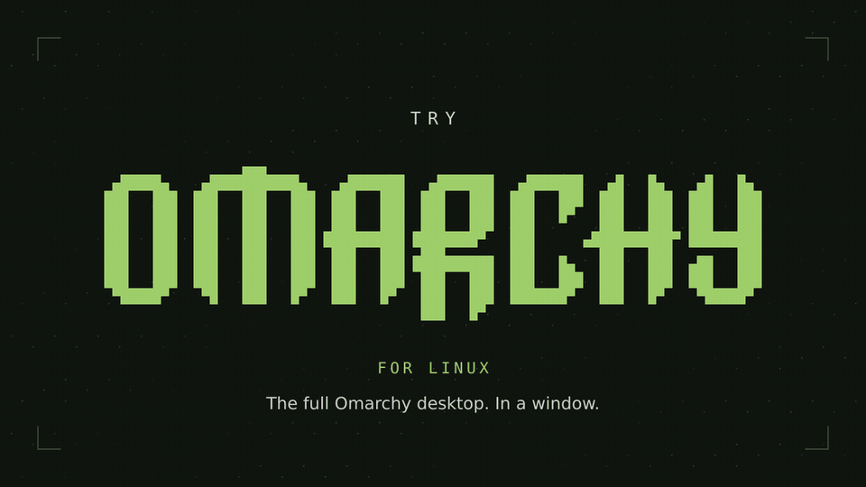
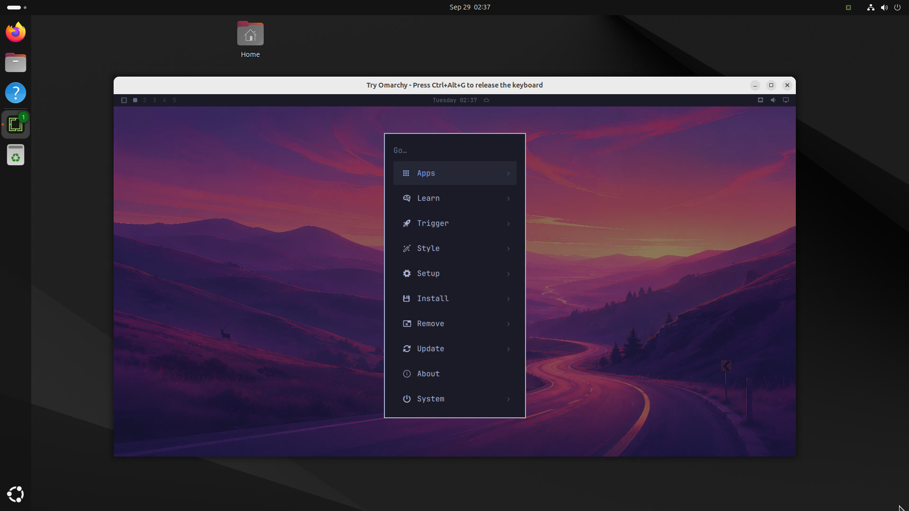

<p align="center">
  <picture>
    <source media="(prefers-reduced-motion: reduce)" srcset="docs/images/try-omarchy-linux-hero.png">
    
  </picture>
</p>

<h1 align="center">Try Omarchy for Linux</h1>

<p align="center">The full Omarchy desktop, running in a window on your Linux PC.</p>

<p align="center">
  <strong><a href="https://tryomarchy.com/linux.flatpakref">Download for Linux</a></strong>
  &nbsp;·&nbsp; <a href="https://tryomarchy.com/linux/">tryomarchy.com/linux</a>
  &nbsp;·&nbsp; <a href="docs/LINUX-HELP.md">User guide</a>
</p>

<p align="center">Preview · Hardware testing in progress</p>

<p align="center">x86_64 · KVM required · Flatpak · Wayland or X11</p>

Try Omarchy runs [Omarchy](https://omarchy.org) in a virtual machine. You can explore its apps, themes, and keyboard-first workflow without replacing your current distro or repartitioning a drive. It is the full Omarchy desktop, not a demo or time-limited trial, and your Omarchy files persist between sessions.

This is the Linux version of [Try Omarchy for Windows](https://github.com/omacom/try-omarchy-windows) and [Try Omarchy for macOS](https://github.com/omacom/try-omarchy). It shares the Windows launcher's code and adds a Linux front end, a Flatpak package, and Linux guest integration.



## Get started

1. **[Download the installer](https://tryomarchy.com/linux.flatpakref)** and open it with **Software**, **Discover** or your distribution's Flatpak installer, then choose **Install**. On Ubuntu or NixOS, complete the setup below first.
2. **Open Try Omarchy from your application menu.** Choose **Set up Omarchy**, then **Set up my own account** to pick your username and password, or **Quick start as omarchy** to skip that and sign in as `omarchy` with the password `omarchy`. Setup then downloads Omarchy (about 2 GB). **Customize** lets you choose another folder first.
3. **Start exploring.** **Super+Space** opens Omarchy's menu. **Ctrl+Alt+G** gives your keyboard back to your Linux desktop, and **Ctrl+Alt+F** switches fullscreen.

<details>
<summary>Ubuntu setup</summary>

Ubuntu's App Center does not install Flatpaks. Install Software and its Flatpak support:

```sh
sudo apt update
sudo apt install flatpak gnome-software gnome-software-plugin-flatpak
```

Log out and back in, then open the downloaded installer with **Software**.

After installing, launch **Try Omarchy from the application menu**. On Ubuntu 24.04, Software’s **Open** button can fail with `ldconfig failed, exit status 256` because AppArmor blocks its sandbox launch. The application-menu launcher avoids this issue.

</details>

<details>
<summary>Fedora, Linux Mint and NixOS</summary>

On Fedora, Software may ask whether to enable third-party repositories. Choose **Enable**. The app's GNOME runtime comes from Flathub, and enabling it uses Fedora's own Flathub setup. Choosing **Ignore** still works, but Flatpak then adds a second Flathub source named `flathub-1` for the runtime.

On Linux Mint, Software Manager lists the app as `com.tryomarchy.TryOmarchy` with a generic icon and an **Unverified Flatpak** badge before it is installed, as it does for any app from outside Flathub. The installed app has its proper name and icon.

NixOS does not enable Flatpak by default. Add `services.flatpak.enable = true;` to `/etc/nixos/configuration.nix`, run `sudo nixos-rebuild switch`, then log out and back in. You don't need to add Flathub first. The installer adds it for the app's GNOME runtime.

</details>

<details>
<summary>Install from a terminal</summary>

After installing Flatpak:

```sh
flatpak install --user https://tryomarchy.com/linux.flatpakref
```

Each [release](https://github.com/btsouth/try-omarchy-linux/releases) also has the installer and a standalone `.flatpak` bundle.

</details>

Your VM and files stay between sessions. Clipboard sharing is optional. The [user guide](docs/LINUX-HELP.md) covers setup, updates, storage, backups and removal.

Signed-repository releases receive updates through Software or `flatpak update`.

<details>
<summary>Coming from preview 1</summary>

Preview 1 was a standalone bundle, so it never updates itself, and while it is installed your application menu keeps opening it. Shut down Omarchy and close Try Omarchy, then remove preview 1 without deleting its data:

```sh
flatpak uninstall --user com.tryomarchy.TryOmarchy//master
```

Answer no if Flatpak offers to delete the app's data. Then install the new release as above. Your VM, account and files are still there the next time you open Try Omarchy, and later updates arrive through Software.

</details>

## What you can do

- **Use the whole desktop.** Hyprland, Omarchy's apps, themes, menus, and notifications run inside the window, with GPU acceleration through VirGL. Software rendering is available when the GPU path is not.
- **Move between your desktop and Omarchy.** Share text, images, and files through the clipboard, drop files into Omarchy, and pick a shared folder. On GNOME, Try Omarchy explains the clipboard permission before GNOME asks, and Settings can turn sharing on or off later.
- **Keep your shortcuts straight.** While the Omarchy window is focused, Super and the rest of your keyboard go to Omarchy. Ctrl+Alt+G gives the keyboard back to your desktop until you click the window again.
- **Keep your work.** The guest disk persists. Back it up, restore a backup as a separate copy, move or reset it while retaining the original, attach an existing VM folder, or delete the app's own VM from the app.
- **Make it yours.** Choose memory, processors, rendering, fullscreen launch, and microphone access in Settings.

The Flatpak does not get access to your home folder. Folders and files reach the app through the desktop's file chooser and document portal.

## Preview limits

Camera capture, live audio route switching, touchpad gestures, bridged/LAN networking,
USB passthrough, opening host apps from the guest, and host biometric authentication
are outside the first Linux release. The published preview 4 requires stopping and starting the VM to change audio
routes. Development builds switch playback and microphone devices from Settings
while Omarchy runs; microphone permission changes still require a new launch. Networking uses NAT with local SSH and port forwarding.

Real GPU, audio, microphone, battery, suspend/resume and monitor behavior still
need reports from hardware testers. Isolated desktop VM tests do not establish
hardware support. See the [hardware testing checklist](docs/LINUX-HARDWARE-TESTING.md).

## Before you start

- You need a **64-bit x86 PC** with hardware virtualization enabled and access to `/dev/kvm`. ARM64 is not supported.
- The app is a **Flatpak** built on the GNOME runtime. Install Flatpak support for your distribution before opening the installer; Ubuntu and NixOS instructions are above.
- Tested end to end on fresh **Ubuntu 24.04, Fedora 44, Linux Mint 22.3 and NixOS 26.05** installs (GNOME Wayland and Cinnamon X11). KDE Plasma on Wayland and Xfce on X11 were tested on earlier builds. Omarchy/Hyprland hosts and more physical hardware still need testing.
- A user reported it working on **Debian testing (forky) with COSMIC** on Wayland, installed as a `--user` Flatpak through COSMIC Store on an Intel i3-8130U laptop with UHD 620 graphics and 16 GB of RAM. See [reports so far](docs/LINUX-HARDWARE-TESTING.md#reports-so-far).
- Keep about **15 GB free** for Omarchy and its runtime. First setup downloads a guest image of about 2 GB. Omarchy sees a 24 GB disk, but only what it uses takes space.

## Build from source

The build runs `flatpak-builder` in the pinned Flathub build container, so you need Docker.

```sh
git clone https://github.com/btsouth/try-omarchy-linux
cd try-omarchy-linux
runtime-build/linux/build-flatpak.sh /tmp/try-omarchy-flatpak
flatpak install --user --bundle /tmp/try-omarchy-flatpak/com.tryomarchy.TryOmarchy.flatpak
```

A local build installs without an update source. [Releasing the Linux app](docs/LINUX-RELEASING.md) describes how signed releases reach the repository.

To run the launcher tests and checks:

```sh
scripts/linux/check.sh /tmp/try-omarchy-checks
```

## Under the hood

Try Omarchy uses QEMU with KVM, VirGL for OpenGL acceleration, and an x86_64 Arch guest image. The Go launcher in [app](app) handles setup, VM supervision, backups, and host integration, and is shared with the Windows version. The GTK home and setup window is in [linux-ui](linux-ui). The Flatpak manifest, QEMU patches, and build script are in [runtime-build/linux](runtime-build/linux), and the guest patches are in [guest-build](guest-build).

Shared launcher fixes come from the Windows repository. This repository keeps its history so those changes merge normally.

## Credits and license

Try Omarchy for Linux builds on [Omarchy](https://github.com/basecamp/omarchy), Eduardo's original Try Omarchy app, Jorge Silva's [guest builder](https://github.com/jorge-huxley/try-omarchy-win), [QEMU](https://www.qemu.org), and [virglrenderer](https://gitlab.freedesktop.org/virgl/virglrenderer).

Scripts and documentation in this repository are [MIT licensed](LICENSE). Omarchy and the guest image carry their own licenses; see the [third-party notices](THIRD_PARTY_NOTICES.md). The app icon uses the [official Omarchy mark](https://omarchy.org/brand/), which remains subject to Omarchy's trademark rights.
