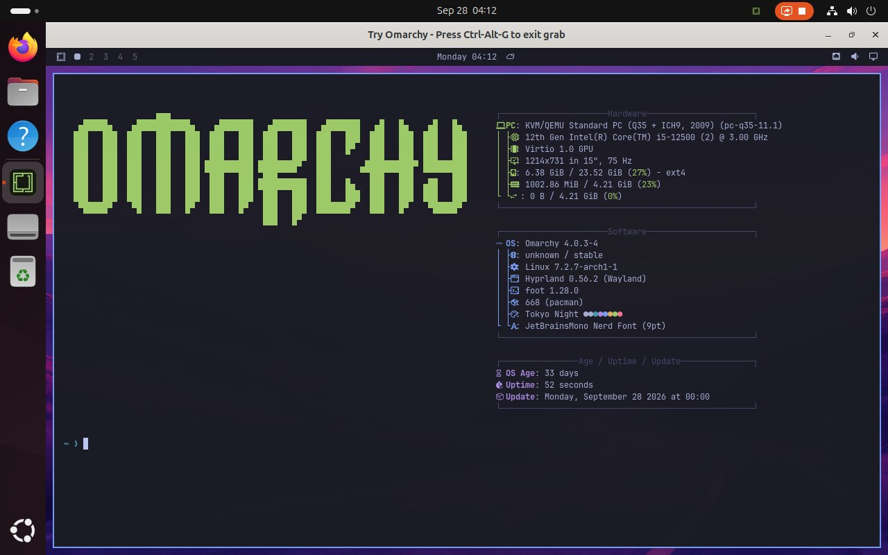

<p align="center">
  
</p>

<h1 align="center">Try Omarchy for Linux</h1>

<p align="center">The full Omarchy desktop, running in a window on your Linux PC.</p>

<p align="center">Preview · Not released yet · Flathub listing planned</p>

<p align="center">x86_64 · KVM required · Flatpak · Wayland or X11</p>



Try Omarchy runs [Omarchy](https://omarchy.org) in a virtual machine. You can explore its apps, themes, and keyboard-first workflow without replacing your current distro or repartitioning a drive. Your Omarchy files persist between sessions.

This is the Linux version of [Try Omarchy for Windows](https://github.com/omacom/try-omarchy-windows) and [Try Omarchy for macOS](https://github.com/omacom/try-omarchy). It shares the Windows launcher's code and adds a Linux front end, a Flatpak package, and Linux guest integration.

## Status

The Linux app works end to end in testing but has no public release yet. The guest image it downloads on first run is published as the [linux-v0.1.0 pre-release](https://github.com/btsouth/try-omarchy-linux/releases/tag/linux-v0.1.0), so a build from this repository completes setup. The app itself will be published on Flathub.

What is left before that release is tracked in the [release gates](docs/LINUX-RELEASE-GATES.md). The main items are guest updates and rollback, reset and move in the app, the public guest download, and testing across more desktops and hardware.

## What you can do

- **Use the whole desktop.** Hyprland, Omarchy's apps, themes, menus, and notifications run inside the window, with GPU acceleration through VirGL. Software rendering is available when the GPU path is not.
- **Move between your desktop and Omarchy.** Share text, images, and files through the clipboard, drop files into Omarchy, and pick a shared folder. On GNOME, clipboard sync asks for permission once through the desktop's portal.
- **Keep your work.** The guest disk persists. Back it up, restore a backup as a separate copy, attach an existing VM folder, or delete the app's own VM from the app.
- **Make it yours.** Choose memory, processors, rendering, fullscreen launch, and microphone access in Settings.

The Flatpak does not get access to your home folder. Folders and files reach the app through the desktop's file chooser and document portal.

## Before you start

- You need a **64-bit x86 PC** with hardware virtualization enabled and access to `/dev/kvm`. ARM64 is not supported.
- The app is a **Flatpak** built on the GNOME runtime. Most distros include Flatpak. On Ubuntu, install it first with `sudo apt install flatpak`.
- It has been tested mostly on **GNOME Wayland**. Omarchy, KDE Plasma, and X11 sessions are part of the release matrix and have not been fully tested yet.
- First setup downloads a guest image of about 2 GB and creates a 24 GB disk in the folder you choose.

## Build from source

The build runs `flatpak-builder` in the pinned Flathub build container, so you need Docker.

```sh
git clone https://github.com/btsouth/try-omarchy-linux
cd try-omarchy-linux
runtime-build/linux/build-flatpak.sh /tmp/try-omarchy-flatpak
flatpak install --user --bundle /tmp/try-omarchy-flatpak/com.tryomarchy.TryOmarchy.flatpak
```

To run the launcher tests and checks:

```sh
scripts/linux/check.sh /tmp/try-omarchy-checks
```

## Under the hood

Try Omarchy uses QEMU with KVM, VirGL for OpenGL acceleration, and an x86_64 Arch guest image. The Go launcher in [app](app) handles setup, VM supervision, backups, and host integration, and is shared with the Windows version. The GTK home and setup window is in [linux-ui](linux-ui). The Flatpak manifest, QEMU patches, and build script are in [runtime-build/linux](runtime-build/linux), and the guest patches are in [guest-build](guest-build).

Linux planning and acceptance notes:

- [Plan](docs/LINUX-PLAN.md) and [parity with Windows and Mac](docs/LINUX-PARITY.md)
- [Release gates](docs/LINUX-RELEASE-GATES.md) and [private acceptance](docs/LINUX-ACCEPTANCE.md)
- [Test evidence](docs/evidence), dated by phase

Shared launcher fixes come from the Windows repository. This repository keeps its history so those changes merge normally.

## Credits and license

Try Omarchy for Linux builds on [Omarchy](https://github.com/basecamp/omarchy), Eduardo's original Try Omarchy app, Jorge Silva's [guest builder](https://github.com/jorge-huxley/try-omarchy-win), [QEMU](https://www.qemu.org), and [virglrenderer](https://gitlab.freedesktop.org/virgl/virglrenderer).

Scripts and documentation in this repository are [MIT licensed](LICENSE). Omarchy and the guest image carry their own licenses; see the [third-party notices](THIRD_PARTY_NOTICES.md). The app icon uses the [official Omarchy mark](https://omarchy.org/brand/), which remains subject to Omarchy's trademark rights.
